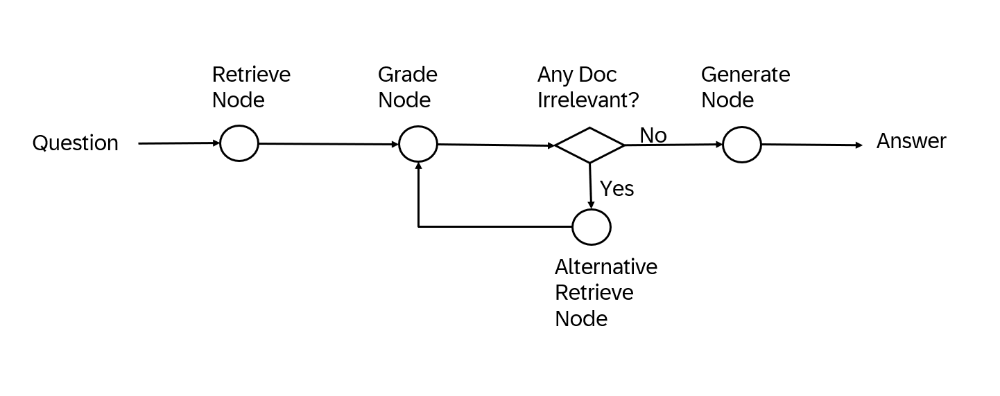
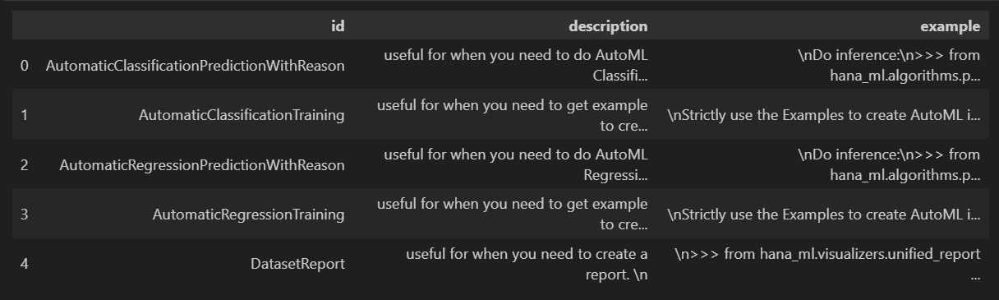

# Project Introduction

This project provides a HANA dataframe agent for users to utilize.

## What's New
* Embedding Service API
* Corrective Retriever
* Union Vector Stores
* Local Embeddings Procedure API
* DataFrame Agent with HANA-ML Toolkit
* Smart DataFrame
* Chatbot Agent

## Embedding Service API
```python
from generative_ai_toolkit_for_sap_hana_cloud.vectorstore.embedding_service import GenAIHubEmbeddings

model = GenAIHubEmbeddings()
model('hello')
```


```python
from generative_ai_toolkit_for_sap_hana_cloud.vectorstore.embedding_service import PALModelEmbeddings

model = PALModelEmbeddings(connection_context)
model(['hello', 'world'])
```


```python
from generative_ai_toolkit_for_sap_hana_cloud.vectorstore.embedding_service import HANAVectorEmbeddings

model = HANAVectorEmbeddings(connection_context)
model(['hello', 'world'])
```


## Corrective Retriever



```python
from generative_ai_toolkit_for_sap_hana_cloud.vectorstore.corrective_retriever import CorrectiveRetriever

cr = CorrectiveRetriever(hana_vec, llm, max_iter=3, recursion_limit=10)
result = cr.query("Automatic classification code?")
print(result)
```


## Union Vector Stores
```python
from generative_ai_toolkit_for_sap_hana_cloud.vectorstore.union_vector_stores import UnionVectorStores

uvs = UnionVectorStores([hana_vec, hana_kg])
uvs.query("AutoML classification", top_n=2)
```

## Corrective Retriever with Multiple Vector Stores
```python
cr = CorrectiveRetriever(uvs, llm, max_iter=3, recursion_limit=10)
result = cr.query("Automatic classification code?")
```

## Local Embeddings Procedure API
```python
df.head(5).collect()
```




```python
print(pe.query("Automatic classification code?"))
```


## DataFrame Agent Example

### Import Modules

```python
from hana_ml import dataframe
from hana_ml.algorithms.pal.utility import DataSets
from generative_ai_toolkit_for_sap_hana_cloud.agents.hana_dataframe_agent import create_hana_dataframe_agent
from generative_ai_toolkit_for_sap_hana_cloud.tools.toolkit import HANAMLToolkit
from generative_ai_toolkit_for_sap_hana_cloud.vectorstore.embedding_service import GenAIHubEmbeddings
from generative_ai_toolkit_for_sap_hana_cloud.vectorstore.hana_vector_engine import HANAMLinVectorEngine
```

### Load Data

```python
cc = dataframe.ConnectionContext(url, port, user, pwd, encrypt=True, sslValidateCertificate=False)
data = DataSets.load_covid_data(cc)
```

### Use GenAIHub Embedding Model

```python
embedding_func = GenAIHubEmbeddings()
```

### Create Knowledge Base for hana-ml codes in Hana Vector Engine

```python
hanavec = HANAMLinVectorEngine(cc, "hana_vec_hana_ml_knowledge")
hana_vec.create_knowledge()
```

### Create HANAML Toolkits and Add Knowledge Bases to It

```python
toolkit = HANAMLToolkit()
toolkit.set_vectordb(hanavec)
```

### Create HANA Dataframe Agent and Execute Task

```python
agent = create_hana_dataframe_agent(llm=llm, toolkit=toolkit, df=data, verbose=True)
agent.invoke("Create Automatic Regression model on this dataframe with max_eval_time_mins=10. Provide key is ID, background_size=100 and model_table_name='my_model' in the fit function and execute it. ")
```


```python
agent.invoke("create a dataset report.")
```


### Smart DataFrame

```python
from generative_ai_toolkit_for_sap_hana_cloud.smart_dataframe import SmartDataFrame

sdf = SmartDataFrame(hana_df)
sdf.configure(toolkit=toolkit, llm=llm)
sdf.ask("Show the samples of the dataset", verbose=True)
```


```python
new_df = sdf.transform("Get first two rows", verbose=True)
```


```python
new_df.collect()
```

