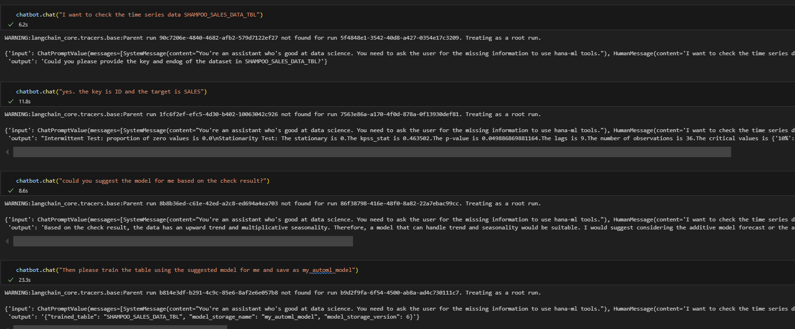
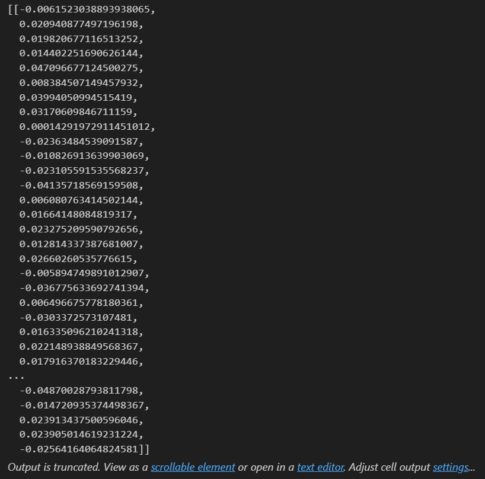
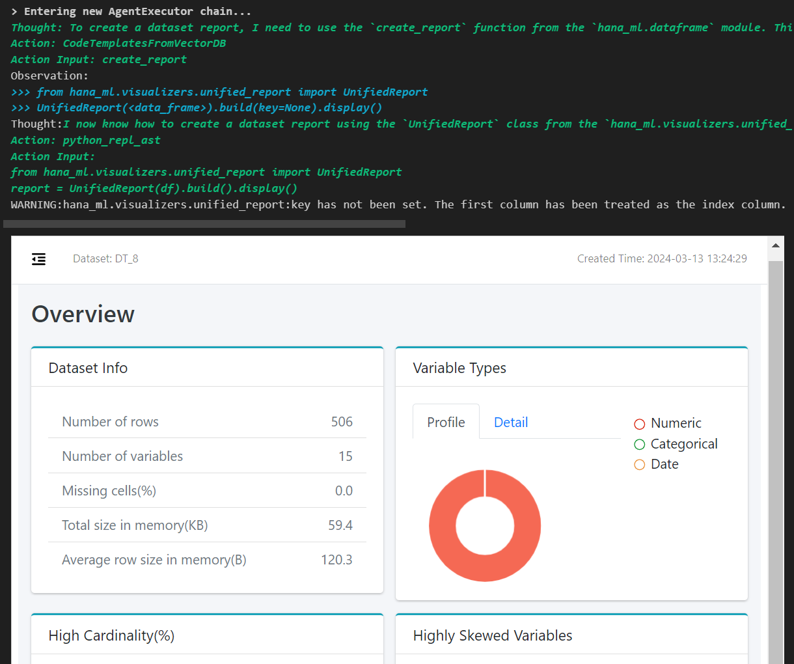
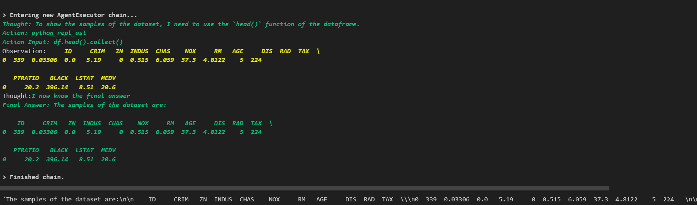
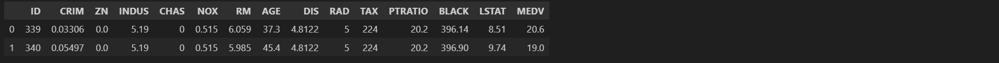

# Project Introduction

This project provides a HANA dataframe agent for users to utilize.

## What's New
* Embedding Service API
* Corrective Retriever
* Union Vector Stores
* Local Embeddings Procedure API
* DataFrame Agent with HANA-ML Code Knowledge Base
* Smart DataFrame
* Chatbot Agent
* AI Toolkit for HANA-ML

## Supported AI Tools for HANA-ML in HANAML toolkit (in progress)
| Tool Name | Description |
|-----------|-------------|
| additive_model_forecast_fit_and_save | To fit an AutomaticTimeseries model and save it in the model storage. |
| additive_model_forecast_load_model_and_predict | To load an AutomaticTimeseries model and predict the future values. |
| automatic_timeseries_fit_and_save | To fit an AutomaticTimeseries model and save it in the model storage. |
| automatic_timeseries_load_model_and_predict | To load an AutomaticTimeseries model and predict the future values. |
| automatic_timeseries_load_model_and_score | To load an AutomaticTimeseries model and score the model. |
| ts_check | To check the time series data for stationarity, intermittent, trend and seasonality. |
| stationarity_test | To check the stationarity of the time series data. |
| trend_test | To check the trend of the time series data. |
| seasonality_test | To check the seasonality of the time series data. |
| white_noise_test | To check the white noise of the time series data. |
| ts_dataset_report | To generate a report for the time series data. |
| forecast_line_plot | To generate line plot for the forecasted result. |
| cap_artifacts | To generate CAP artifacts from the model in the model storage. |
| intermittent_forecast | To forecast the intermittent time series data. |
| ts_outlier_detection | To detect the outliers in the time series data. |

## Langchain Agent with HANAML Toolkit
```python
from hana_ai.agents.chatbot_with_memory import ChatbotWithMemory

tools = HANAMLToolkit(cc, used_tools='all').get_tools()
chatbot = ChatbotWithMemory(llm=llm, toos=tools, session_id='hana_ai_test', n_messages=10)
```


## Embedding Service API
```python
from hana_ai.vectorstore.embedding_service import GenAIHubEmbeddings

model = GenAIHubEmbeddings()
model('hello')
```


```python
from hana_ai.vectorstore.embedding_service import PALModelEmbeddings

model = PALModelEmbeddings(cc)
model(['hello', 'world'])
```


```python
from hana_ai.vectorstore.embedding_service import HANAVectorEmbeddings

model = HANAVectorEmbeddings(cc)
model(['hello', 'world'])
```



## Union Vector Stores
```python
from hana_ai.vectorstore.union_vector_stores import UnionVectorStores

uvs = UnionVectorStores([hana_vec, hana_kg])
uvs.query("AutoML classification", top_n=2)
```

## Corrective Retriever Over Union Vector Stores
```python
from hana_ai.vectorstore.corrective_retriever import CorrectiveRetriever

cr = CorrectiveRetriever(uvs)
cr.query("AutoML classification", top_n=2)
```

## DataFrame Agent Example

### Import Modules

```python
from hana_ml import dataframe
from hana_ml.algorithms.pal.utility import DataSets
from hana_ai.agents.hana_dataframe_agent import create_hana_dataframe_agent
from hana_ai.tools.toolkit import HANAMLToolkit
from hana_ai.vectorstore.embedding_service import GenAIHubEmbeddings
from hana_ai.vectorstore.hana_vector_engine import HANAMLinVectorEngine
```

### Load Data

```python
cc = dataframe.ConnectionContext(url, port, user, pwd, encrypt=True, sslValidateCertificate=False)
data = DataSets.load_covid_data(cc)
```

### Use GenAIHub Embedding Model

```python
embedding_func = GenAIHubEmbeddings()
```

### Create Knowledge Base for hana-ml codes in Hana Vector Engine

```python
hanavec = HANAMLinVectorEngine(cc, "hana_vec_hana_ml_knowledge")
hana_vec.create_knowledge()
```

### Create Code Template Tool and Add Knowledge Bases to It

```python
code_tool = GetCodeTemplateFromVectorDB()
code_tool.set_vectordb(self.vectordb)
```

### Create HANA Dataframe Agent and Execute Task

```python
agent = create_hana_dataframe_agent(llm=llm, tools=[code_tool], df=data, verbose=True)
agent.invoke("Create Automatic Regression model on this dataframe with max_eval_time_mins=10. Provide key is ID, background_size=100 and model_table_name='my_model' in the fit function and execute it. ")
```


```python
agent.invoke("create a dataset report.")
```


### Smart DataFrame

```python
from hana_ai.smart_dataframe import SmartDataFrame

sdf = SmartDataFrame(hana_df)
sdf.configure(tools=[code_tool], llm=llm)
sdf.ask("Show the samples of the dataset", verbose=True)
```


```python
new_df = sdf.transform("Get first two rows", verbose=True)
```


```python
new_df.collect()
```

