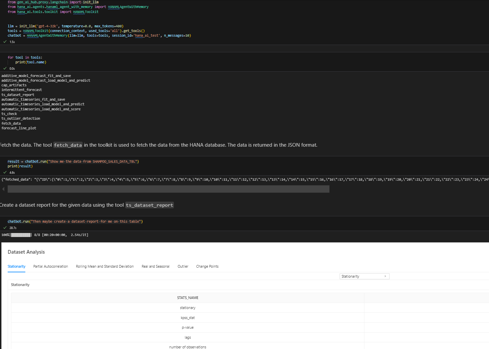
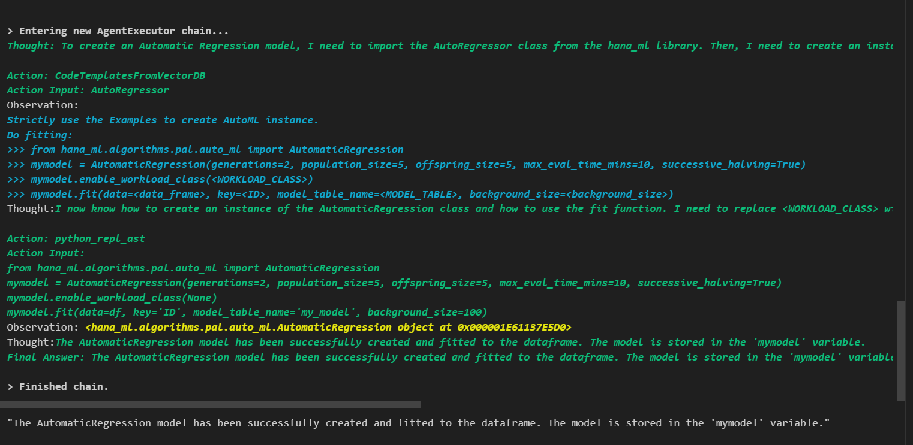
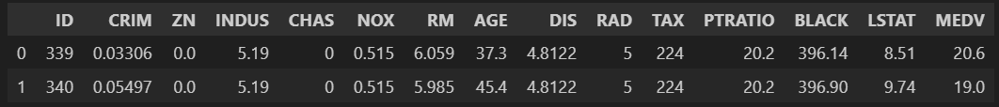

Generative AI Toolkit for SAP HANA Cloud
========================================

Welcome to Generative AI Toolkit for SAP HANA Cloud (hana.ai)!

This package enables the users to access SAP HANA data and build various machine
learning models using the data directly in SAP HANA via natural language. This page provides an overview of hana.ai.

Generative AI Toolkit for SAP HANA Cloud consists of four main parts:

  - AI tools, which provides a set of tools to analyze data and build machine learning models.
  - HANA Vector Store and Knowledge Base API, which provides a way to store and retrieve vectors and knowledge bases.
  - Smart DataFrame, which is a HANA dataframe Agent to interact with HANA data.
  - Chatbot Agents, which provides a way to interact with the AI tools and HANA Vector Store and Knowledge Base API via natural language.

Prerequisites
-------------

  - **SAP HANA Python Driver** : hdbcli. Please see `SAP HANA Client Interface Programming Reference
    <https://help.sap.com/docs/SAP_HANA_CLIENT/f1b440ded6144a54ada97ff95dac7adf/f3b8fabf34324302b123297cdbe710f0.html>`_
    for more information.

  - **SAP HANA PAL** : Security **AFL__SYS_AFL_AFLPAL_EXECUTE** and
    **AFL__SYS_AFL_AFLPAL_EXECUTE_WITH_GRANT_OPTION** roles. See `SAP HANA
    Predictive Analysis Library
    <https://help.sap.com/docs/hana-cloud-database/sap-hana-cloud-sap-hana-database-predictive-analysis-library/sap-hana-cloud-sap-hana-database-predictive-analysis-library-pal>`_
    for more information.

  - **SAP HANA APL** 1905 or higher. See
    `SAP HANA Automated Predictive Library Developer Guide
    <https://help.sap.com/viewer/product/apl/latest/en-US>`_
    for more information. Only valid when using the APL package.

  - **Python Machine Learning Client for SAP HANA** version 2.24 or higher : Install it using ``pip install -U hana-ml``.
    For more details, refer to the `Documentation <https://help.sap.com/doc/cd94b08fe2e041c2ba778374572ddba9/latest/en-US/hana_ml.html>`_.

  - **Generative-AI-Hub-SDK**: Install it using ``pip install "generative-ai-hub-sdk[all]"``.
    For comprehensive instructions, see the `SAP Learning Unit on Using Generative-AI-Hub-SDK <https://learning.sap.com/learning-journeys/solving-your-business-problems-using-prompts-and-llms-in-sap-s-generative-ai-hub/identifying-the-need-for-using-generative-ai-hub-sdk>`_.

  - Ensure that you have access to generative AI hub and deployed models in SAP Business Technology Platform. For more information, see the `Create a Deployment for a Generative AI Model <https://help.sap.com/docs/sap-ai-core/sap-ai-core-service-guide/create-deployment-for-generative-ai-model-in-sap-ai-core>`_.

Langchain Agent with HANAML Toolkit
-----------------------------------

HANAML Toolkit is a set of tools to analyze data and build machine learning models using the data directly in SAP HANA. It can be consumed by AI Agent. cc is a connection to a SAP HANA instance. ::

    from hana_ai.agents.hanaml_agent_with_memory import HANAMLAgentWithMemory
    from hana_ai.tools.toolkit import HANAMLToolkit

    tools = HANAMLToolkit(connection_context=cc, used_tools='all').get_tools()
    chatbot = HANAMLAgentWithMemory(llm=llm, tools=tools, session_id='hana_ai_test', n_messages=10)

HANA Vector Store and Knowledge Base API
----------------------------------------

Create Knowledge Base for hana-ml codes in HANA Vector Engine. ::

    hana_vec = HANAMLinVectorEngine(connection_context=cc, table_name="hana_vec_hana_ml_knowledge")
    hana_vec.create_knowledge()

Create Code Template Tool and Add Knowledge Bases to It
-------------------------------------------------------

Create a code template tool and add knowledge bases to it. ::

    from hana_ai.tools.code_template_tools import GetCodeTemplateFromVectorDB

    code_tool = GetCodeTemplateFromVectorDB()
    code_tool.set_vectordb(vectordb=self.vectordb)

Create HANA Dataframe Agent and Execute Task
--------------------------------------------

Create a HANA dataframe agent and execute a task. ::

    from hana_ai.agents.hana_dataframe_agent import create_hana_dataframe_agent

    agent = create_hana_dataframe_agent(llm=llm, tools=[code_tool], df=data, verbose=True)
    agent.invoke("Create Automatic Regression model on this dataframe with max_eval_time_mins=10. Provide key is ID, background_size=100 and model_table_name='my_model' in the fit function and execute it. ")

Build a dataset report. ::

    agent.invoke("Build a dataset report")

.. image:: image/dataset_report.png
   :width: 961px
   :height: 650px
   :scale: 80 %
   :alt: A HANA dataframe agent to generate a dataset report.

Smart DataFrame
---------------

Smart DataFrame is a HANA dataframe Agent to interact with HANA data. ::

    from hana_ai.smart_dataframe import SmartDataFrame

    sdf = SmartDataFrame(dataframe=hana_df)
    sdf.configure(tools=[code_tool], llm=llm)
    new_df = sdf.transform(question="Get first two rows", verbose=True)
    new_df.collect()

