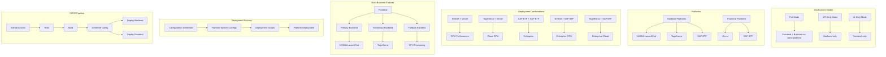

```mermaid
flowchart TD
    subgraph "Deployment Modes"
        direction TB
        A[Full Mode] --> A1[Frontend + Backend on same platform]
        B[API-Only Mode] --> B1[Backend only]
        C[UI-Only Mode] --> C1[Frontend only]
    end

    subgraph "Platforms"
        direction TB
        D[Backend Platforms] --> D1[NVIDIA LaunchPad]
        D --> D2[Together.ai]
        D --> D3[SAP BTP]
        
        E[Frontend Platforms] --> E1[Vercel]
        E --> E2[SAP BTP]
    end

    subgraph "Deployment Combinations"
        direction TB
        F[NVIDIA + Vercel] --> F1[GPU Performance]
        G[Together.ai + Vercel] --> G1[Cloud GPU]
        H[SAP BTP + SAP BTP] --> H1[Enterprise]
        I[NVIDIA + SAP BTP] --> I1[Enterprise GPU]
        J[Together.ai + SAP BTP] --> J1[Enterprise Cloud]
    end

    subgraph "Multi-Backend Failover"
        direction TB
        K[Frontend] --> L[Primary Backend]
        K --> M[Secondary Backend]
        K --> N[Fallback Backend]
        
        L --> L1[NVIDIA LaunchPad]
        M --> M1[Together.ai]
        N --> N1[CPU Processing]
    end

    subgraph "Deployment Process"
        direction LR
        O[Configuration Generator] --> P[Platform-Specific Configs]
        P --> Q[Deployment Scripts]
        Q --> R[Platform Deployment]
    end

    subgraph "CI/CD Pipeline"
        direction LR
        S[GitHub Actions] --> T[Tests]
        T --> U[Build]
        U --> V[Generate Config]
        V --> W[Deploy Backend]
        V --> X[Deploy Frontend]
    end
```